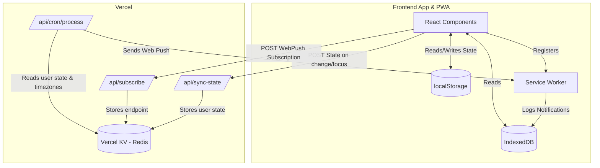

# Pinboard Architecture

Pinboard is an offline-first Progressive Web App (PWA) built with React and Vite. It utilizes Vercel Serverless Functions and Vercel KV (Redis) to provide cloud synchronization and scheduled push notifications.

## System Overview

---

## 1. Frontend (Client-Side)

The frontend acts as the primary brain of the application. To ensure maximum speed and offline capability, the app does **not** fetch state from the server on load; instead, it relies entirely on local storage.

### Core Technologies
- **Framework**: React 18 + Vite
- **Styling**: Tailwind CSS
- **Routing**: Client-side state (Active Tab)

### State Management
- **`localStorage`**: The absolute source of truth. All habits, tasks, goals, and settings are saved here.
- **Sync Hooks (`src/utils.js`)**: Whenever state changes in `localStorage`, or when the app regains window focus (`visibilitychange`), a debounced `syncStateToBackend()` call is made to push the latest JSON state to the backend.

### Progressive Web App (PWA)
- **Service Worker (`public/sw.js`)**: Caches static assets for offline use.
- **Push Notifications**: The Service Worker listens for the `push` event, displays the notification to the user, and logs the notification payload into **IndexedDB**.
- **Notification Drawer**: The React frontend reads from IndexedDB to display a history of recent notifications.

---

## 2. Backend (Vercel Serverless)

The backend is intentionally "dumb" and acts primarily as a synchronization and cron-processing layer. It does not validate or mutate user data; it simply reads what the frontend provides to trigger scheduled events.

### Vercel KV (Redis)
Used as a lightweight, low-latency data store.
- **Active Subscriptions**: A Set of all registered Web Push endpoints.
- **User State**: Stored as `user_state_{endpoint}`, containing a mirrored copy of the user's `localStorage` state (habits, tasks, timezone offset).
- **Idempotency Keys**: Ephemeral keys (e.g., `notified_{hash}_ritual_{id}`) to prevent the cron job from sending duplicate notifications.

### API Routes
- **`api/sync-state.js`**: Receives the user's latest habits, tasks, and timezone offset, and upserts them into Vercel KV.
- **`api/subscribe.js`**: Registers a new device's Web Push subscription endpoint to the `active_subscriptions` set.
- **`api/cron/process.js`**: The heart of the notification system.

---

## 3. The Cron Engine (`api/cron/process.js`)

Because standard PWAs cannot natively run background tasks on iOS/Android (without complex background-sync APIs), Pinboard uses a cloud-based Cron job to trigger notifications.

1. **Trigger**: Vercel Cron (or QStash) pings the endpoint every 5-10 minutes.
2. **Iteration**: The script loops through all active subscriptions in KV.
3. **Timezone Math**: It applies the user's `timezoneOffset` (saved during sync) to the current UTC time to calculate the user's exact local time.
4. **Evaluation**:
   - **Fixed Time Habits**: Checks if the user's local time has passed the target time and if they haven't completed the habit yet today.
   - **Interval Habits**: Checks if the elapsed time since the `last_sent` KV key exceeds the required interval.
   - **Daily Reviews**: Summarizes uncompleted tasks and triggers a digest push at the configured time.
5. **Execution**: Uses the `web-push` library to send the payload to the user's Service Worker.

---

## 4. Key Design Decisions

- **Offline-First vs Cloud-First**: By making `localStorage` the source of truth, the app opens instantly with zero loading spinners. The cloud only exists to facilitate background notifications.
- **Service Worker IndexedDB**: `localStorage` is completely inaccessible inside a Service Worker. To maintain a history of received push notifications, the Service Worker writes to IndexedDB, which the React frontend can then query.
- **Conflict Resolution**: Currently, "last write wins" based on the device that most recently ran `syncStateToBackend`. True multi-device syncing would require CRDTs or timestamp-based merging, but the current approach is sufficient for single-user mobile/desktop parity.
